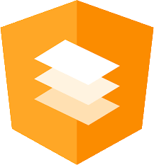
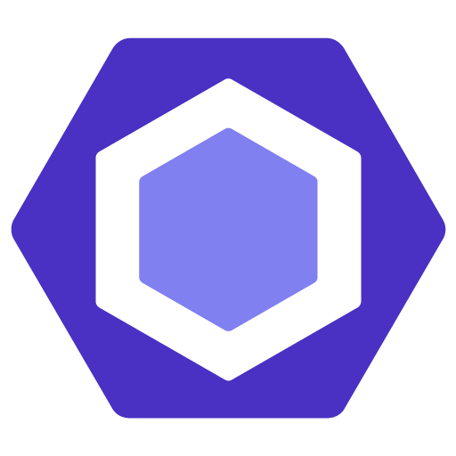
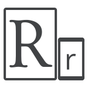

  

<h1 align="center">Olá 👋, Meu nome é Gleison Almeida</h1>
<h4 align="center">Bem vindo ao meu repositório, sou graduando em Sistemas de Informação, apaixonado por aprender, tocar e principalmente codar  e aqui você irá encontrar meus projetos de estudo e poder acompanhar minha evolução diária. 💻</h4>

- 🔭 Atualmente trabalhando no **Itaú Unibanco**
- 💬 Pergunte-me sobre **tech, games, movies, Anki and study techniques.**
- 🎴 Amo **aprender a aprender** e tudo sobre técnicas de **memorização**.

 
 
 
<h3 align="center">Meus contatos:</h3>

**:zap: Atividades Recentes:**

<!--START_SECTION:activity-->

1. 🗣 Commented on [#21](https://github.com/manfredsteyer/module-federation-plugin-example/issues/21) in [manfredsteyer/module-federation-plugin-example](https://github.com/manfredsteyer/module-federation-plugin-example)
2. 🗣 Commented on [#416](https://github.com/infinitered/gluegun/issues/416) in [infinitered/gluegun](https://github.com/infinitered/gluegun)
3. 🗣 Commented on [#1980](https://github.com/module-federation/module-federation-examples/issues/1980) in [module-federation/module-federation-examples](https://github.com/module-federation/module-federation-examples)
<!--END_SECTION:activity-->

**:zap: Minhas Últimas Postagens**

<!-- BLOG-POST-LIST:START -->
- [Angular Schematics — Criando Projetos Customizados](https://gleisonsubzerokz.medium.com/angular-schematics-criando-projetos-customizados-edf89fd434dd?source=rss-b9adbab6e049------2)
- [Entendendo o Decorator @ViewChild— Angular](https://gleisonsubzerokz.medium.com/entendendo-o-decorator-viewchild-angular-93969eee93e3?source=rss-b9adbab6e049------2)
- [A diferença entre Propriedade e Atributo no HTML](https://gleisonsubzerokz.medium.com/a-diferen%C3%A7a-entre-propriedade-e-atributo-no-html-7693b0dd1461?source=rss-b9adbab6e049------2)
- [Extensão Google Chrome com Angular 11](https://gleisonsubzerokz.medium.com/extens%C3%A3o-google-chrome-com-angular-11-cbe148b9ec8c?source=rss-b9adbab6e049------2)
- [Tipagem Forte para Reactive Forms Angular](https://gleisonsubzerokz.medium.com/tipagem-forte-para-reactive-forms-angular-3400416c9a2d?source=rss-b9adbab6e049------2)
<!-- BLOG-POST-LIST:END -->

#### :man_technologist: Minha Stack de Desenvolvimento

<strong>Back-End</strong>

<code>

</code>

<strong>Front-end</strong>

<code>

</code>

<strong>Mobile</strong>

<code>

</code>

<strong>Databases</strong>

<code>

</code>

<strong>Cloud Servers</strong>

<code>

</code>

<strong>Testing</strong>

<code>

</code>

<strong>Bundlers</strong>

<code>

</code>

<strong>Source Control</strong>

<code>

</code>

<strong>Productivity and Standards</strong>

<code>

[insominia-url]: "https://insomnia.rest/"

</code>

<strong>Softwares</strong>

<code>

[insominia-url]: "https://insomnia.rest/"

</code>

 
 

 

